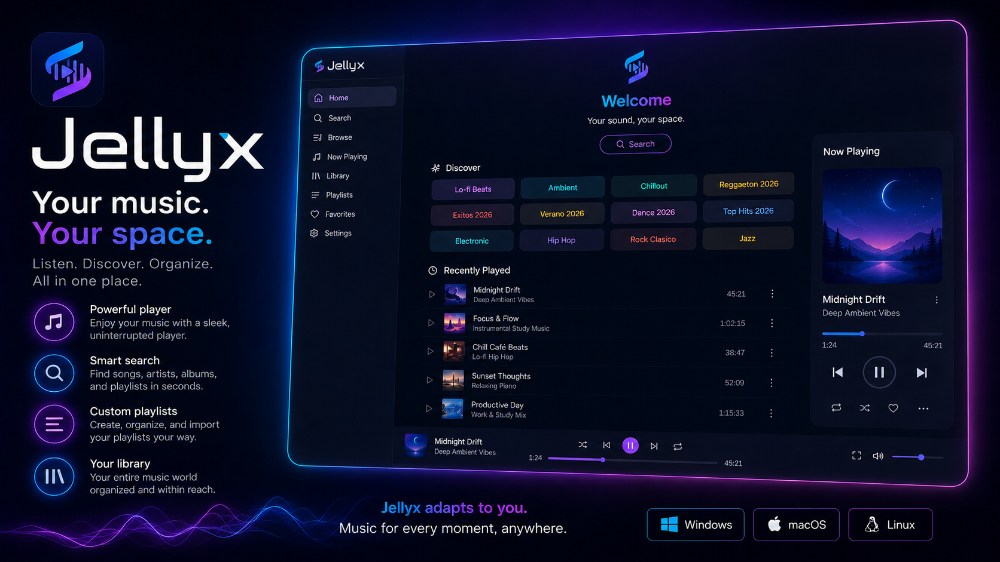
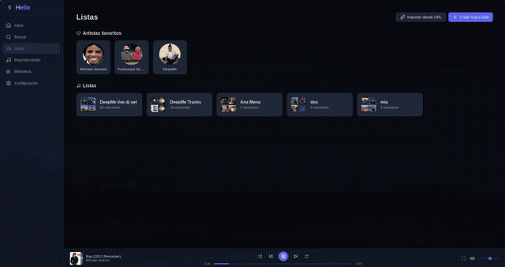
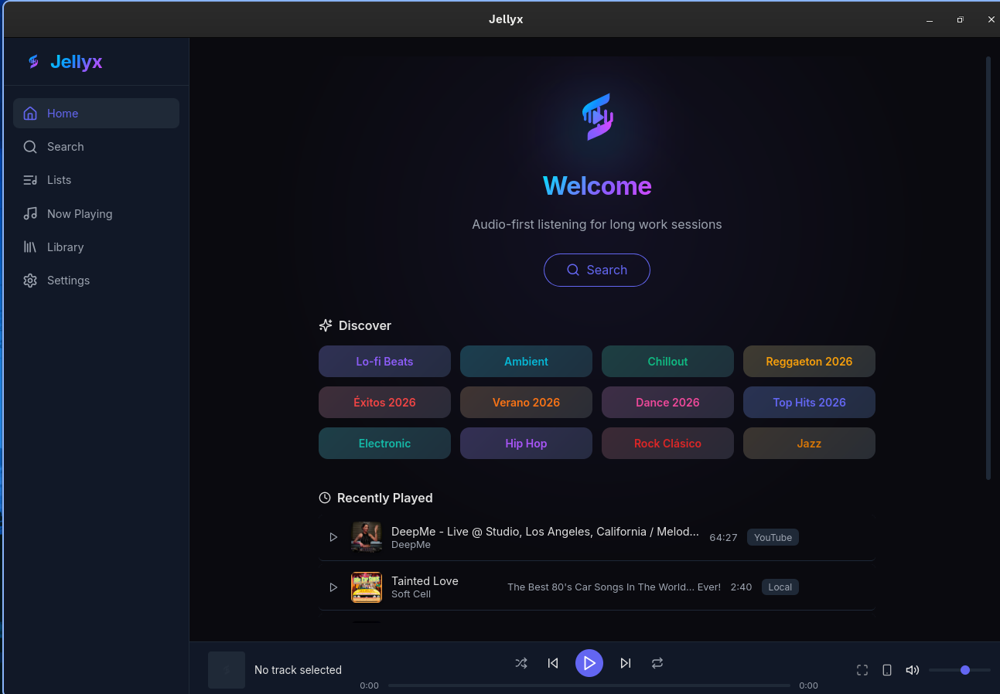
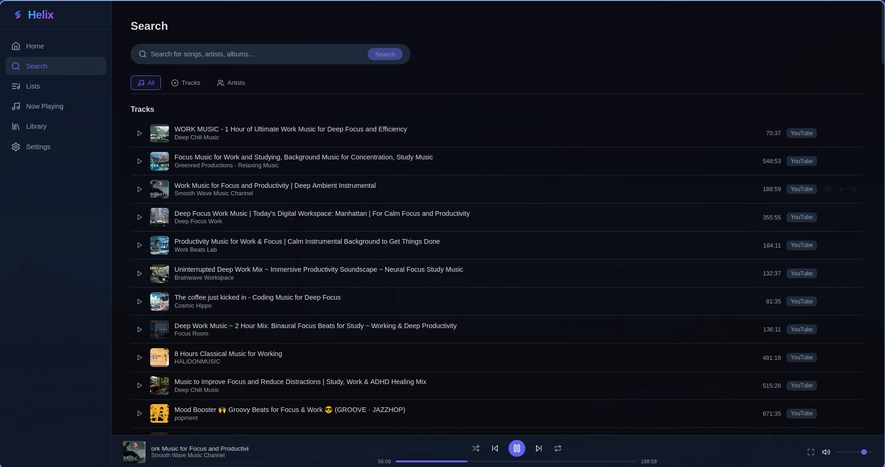
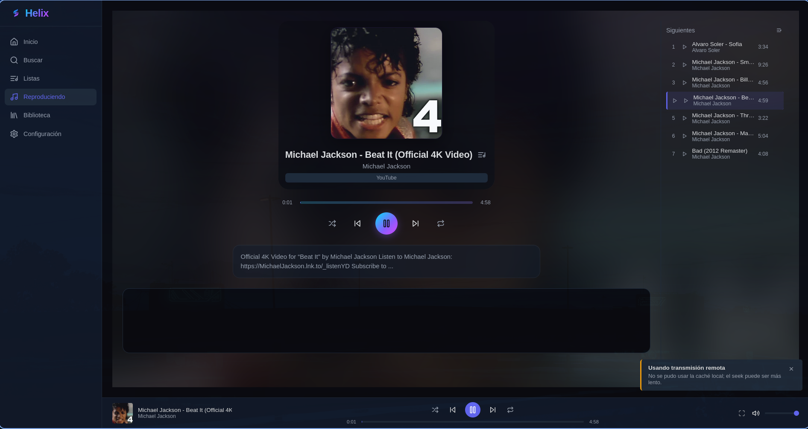
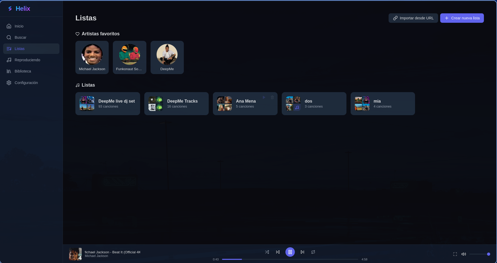

[English](README.md) | [Español](README.es.md)

<p align="center">
  
</p>

<p align="center">
  <b>Desktop background music player for people who work with music on.</b><br>
  Listen to YouTube, SoundCloud and local files without accounts, subscriptions or unnecessary video playback.
  <br>
  <small>Alpha software. Built for my own daily workflow first, shared in case it helps others.</small>
</p>

<p align="center">
  <a href="https://github.com/netcraker01/helix/releases"></a>
  <a href="https://github.com/netcraker01/helix/actions/workflows/release.yml"></a>
  <a href="LICENSE"></a>
  
</p>

<p align="center">
  <a href="#why-helix-exists"><strong>Why Helix exists</strong></a> ·
  <a href="#what-helix-does"><strong>What it does</strong></a> ·
  <a href="#use-cases"><strong>Use cases</strong></a> ·
  <a href="#download"><strong>Download</strong></a> ·
  <a href="#build"><strong>Build</strong></a>
</p>

---

## Helix

Helix is a desktop background music player for people who work with music on.

Many of us open YouTube just to listen to long ambient, focus, lofi, jazz, electronic or live sessions while working. The video is usually hidden, minimized or sitting behind the IDE, but the browser still loads a heavy video-first experience.

Helix exists for that exact workflow. It focuses on the audio: YouTube, SoundCloud and local files in a native desktop app, without accounts, subscriptions or unnecessary video playback.

## Why Helix exists

I built Helix because I wanted a calmer way to keep music running in the background during long work sessions.

- I did not want to keep YouTube open just to listen.
- I did not want another subscription just for background music.
- I wanted YouTube, SoundCloud and local files in one desktop workflow.
- I wanted something simple, honest and focused on audio instead of distraction.

Helix is not trying to be a universal music platform. It is a practical tool for a specific everyday problem: listening to background music while you work.

## What Helix does

- Plays audio from YouTube.
- Plays SoundCloud streams.
- Plays local files.
- Keeps playback centered on audio instead of video.
- Gives you a desktop workflow with queue, playlists, favorites and history.
- Includes real-time visualizers and a cinematic ambient mode if you want a more expressive player view.

## Use cases

- Coding with long ambient or focus sessions from YouTube.
- Design work with lofi, jazz or electronic mixes in the background.
- Long SoundCloud mixes during writing or research sessions.
- Local files for offline work.
- Office background music without leaving a browser tab running unnecessary video playback.

## Who It Is For

- Developers
- Designers
- Writers
- Sysadmins
- Makers
- People who work for hours with music in the background
- People who want YouTube, SoundCloud and local files in one place
- People who do not want another music subscription just for focus music

## What Helix Is Not

- Not a Spotify clone
- Not a professional DJ app
- Not a full media center
- Not a product trying to replace every music player
- Not finished or production-grade yet

Different tools solve different jobs. Helix is for background listening during work, especially when the source is often video-first but the need is really audio-first.

## Privacy And Accounts

Privacy still matters here, but it is not the whole story.

- No account is required for basic use.
- Helix does not add its own tracking system.
- Helix does not require a subscription.
- Helix does not add its own ads.
- External sources may have their own behavior, limits or availability changes.

## AI-Assisted Development

Helix is AI-assisted, human-directed and human-reviewed.

The product direction, requirements, architecture and release decisions are human-led. AI helps with parts of implementation and documentation, but the project is maintained under explicit review and verification.

If you want more detail, see [docs/ENGINEERING-PROCESS.md](docs/ENGINEERING-PROCESS.md).

---

## Watch It In Action

<video src="docs/videos/demo.mp4" controls width="100%" poster="docs/screenshots/now-playing.png">
  
</video>

A short demo of search, playback and the player UI.

---

## Screenshots

<table>
  <tr>
    <td width="50%">
      
      <p align="center"><b>Home</b> - Start quickly and return to what you were already listening to.</p>
    </td>
    <td width="50%">
      
      <p align="center"><b>Search</b> - Look across YouTube and SoundCloud from one place.</p>
    </td>
  </tr>
  <tr>
    <td width="50%">
      
      <p align="center"><b>Now Playing</b> - Keep queue, controls and track context visible.</p>
    </td>
    <td width="50%">
      
      <p align="center"><b>Your Library</b> - Save favorites, playlists and imports for later.</p>
    </td>
  </tr>
</table>

---

## Download

Pick your platform and try the current alpha:

| Platform | Recommended | Alternative |
|---|---|---|
| **Linux** | [`.deb` / `.rpm`](https://github.com/netcraker01/helix/releases) | `AppImage`, `.tar.gz` |
| **macOS** | [DMG for Apple Silicon](https://github.com/netcraker01/helix/releases) | Intel support is still limited in alpha |
| **Windows** | [NSIS setup.exe](https://github.com/netcraker01/helix/releases) | `.msi` or portable `.exe` |

> **Windows note:** Installers are currently unsigned. Windows 11 may show a SmartScreen warning. Click "More info -> Run anyway" to install.

> **Linux note:** For this alpha, `.deb` and `.rpm` are the recommended Linux packages. AppImage is available, but may have graphics or runtime issues on some Wayland setups.

All downloads, checksums and release notes are on the [Releases](https://github.com/netcraker01/helix/releases) page.

## Build

If you want to build Helix yourself:

```bash
git clone https://github.com/netcraker01/helix
cd helix
cargo tauri dev
```

For full build and packaging instructions, see [docs/BUILDING.md](docs/BUILDING.md).

## Contribute

Helix is open source and maintained in the open.

- [Report a bug](https://github.com/netcraker01/helix/issues/new?template=bug_report.md)
- [Suggest a feature](https://github.com/netcraker01/helix/issues/new?template=feature_request.md)
- [Read the contributor guide](CONTRIBUTING.md)
- [See the design tokens](assets/brand/design-tokens.json)

All contributors keep ownership of their work and are credited in [AUTHORS.md](AUTHORS.md).

## Developer Docs

- [Building from source](docs/BUILDING.md)
- [Architecture overview](docs/ARCHITECTURE.md)
- [Platform strategy](docs/PLATFORM.md)
- [UI design](docs/UI_DESIGN.md)
- [Packaging and release guide](docs/packaging.md)
- [Release conventions](docs/release-conventions.md)

## License

Helix is dual-licensed:

- **Open source:** [AGPL-3.0](LICENSE)
- **Commercial:** Available for organizations that cannot comply with AGPL-3.0. Contact the project owner for details.

By contributing, you agree to the [CLA](CLA.md).

---

<p align="center">
  Built with Rust + Tauri v2 + Svelte · Powered by yt-dlp, Symphonia and rustfft
</p>
